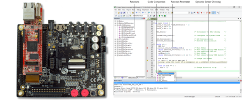

# Introduction

This module introduces the application and implementation of operating
systems and the use of concurrency in systems programming. It presents
fundamental concepts: processes, communication and synchronisation,
and illustrates their implementation using a simple, modern
OS.

Students are given the opportunity to apply an OS in their own
programs to solve a variety of problems. Additional topics such as
memory management, file systems and security are required in the
implementation of a full-scale OS and are investigated in this module.

Lectures are the main vehicle for introducing fundamental concepts and
principles and for providing context and motivation. Students will be
expected to prepare for lecture topics and deepen their understanding
of course material by studying course texts and technical
literature. Seminars and laboratory sessions support the lecture
programme by providing students with opportunities to identify and
apply appropriate techniques for the application and implementation of
a variety of OS services.

Formative assessment will be provided in the form of small weekly
exercises, mainly practical in nature and involving
programming. Summative assessment is by way of a single piece of
coursework comprising a programming assignment and a short report.

# Module Team

|   |    |
|---|:---|
|Module Tutor &nbsp;  | [David Kendall](http://computing.northumbria.ac.uk/staff/cgdk2)|
|Lecturer      | [Michael Brockway](http://computing.northumbria.ac.uk/staff/cgmb3)|
|Lecturer      | [Alun Moon](http://computing.northumbria.ac.uk/staff/cgam1)|

# Teaching Arrangements

|   |    |
|---|:---|
**Lecture (Block A)** &nbsp;| Tue 13.00 - 14.00 EB E004
**Lecture (Block B)** | Mon 10.00 - 11.00 NB 252 
**Lab/Seminar**       | Mon 15.00 - 17.00 PB S2 
**Lab/Seminar**       | Tue 16.00 - 18.00 PB S2 
**Lab/Seminar**       | Thu 09.00 - 11.00 PB S2 
**Lab/Seminar**       | Thu 16.00 - 18.00 PB S2 

You should attend <em>both</em> lecture sessions and <em>one</em> of the
lab/seminar sessions every week. Refer to your personal timetable to identify
the lab session that you should attend.

# Synopsis

The aim of the module is to introduce operating system concepts and
the principles of concurrency, and to develop a practical
understanding of their implementation and application in modern
computing systems. Assessment is by course work.

On completion of this module, it is expected that students will be able to:

1. Describe the architecture of an operating system (OS) and its
services, and evaluate its use in a variety of scenarios.

2. Discuss the process model and the scheduling, IPC and
synchronisation services provided by an OS and reason informally about
the behaviour of a multitasking system under a variety of
scheduling algorithms.

3. Review the principal concepts and methods of memory management
and file system implementation.

4. Identify a variety of security threats and examine appropriate OS
mechanisms to protect against them.

5. Design, implement and evaluate solutions to problems of I/O
device handling, synchronisation, communication and timing for
multitasking systems, using appropriate OS services and concurrent
programming techniques.

# Teaching Plan

The following is a *provisional* guide to the organisation of
this part of the module for this year. These arrangements are subject to
change during the course of the module. This is especially true this year
(2015/16) since we are introducing new, state-of-the-art lab equipment, based
on the NXP LPC4088 ARM Cortex M4 microcontroller. You can expect that all
references to the LPC2378 will be superseded by the time that we reach 
that material.  

| Week   | W/c   | Lecture A   | Lecture B   | Practical   |
| :----: | :---: | :---------: | :---------: | :---------: |
**1** | 21-Sep &nbsp; | [Introduction and overview]({{site.raurl}}/A01.pdf) &nbsp; | [Introduction/review of development tools/environment. Device drivers]({{site.raurl}}/B01.pdf) &nbsp; | [C Programming]({{site.raurl}}/L01.pdf)
**2** | 28-Sep &nbsp; | [C programming for OS]({{site.raurl}}/A02.pdf) | [Interrupts and Interrupt Service Routines (ISR). Context switch]({{site.raurl}}/B02.pdf) &nbsp; | [Output device driver: LED](L02.html)
**3** | 05-Oct &nbsp; | [Process concept]({{site.raurl}}/A03.pdf) &nbsp; | [LPC4088: Interrupts, Nested Vectored Interrupt Controller (NVIC), ISR implementation, Timers]({{site.raurl}}/B03.pdf) &nbsp; | [Input device driver: Buttons and joystick](L03.html)
**4** | 12-Oct &nbsp; | [Process scheduling]({{site.raurl}}/A04.pdf) &nbsp; | [Introduction to uC/OS-II: tasks, delays, memory layout]({{site.raurl}}/B04.pdf) &nbsp; | [Interrupt generation and handling: Timers](L04.html)
**5** | 19-Oct &nbsp; | [Memory management&nbsp;1]({{site.raurl}}/A05.pdf) &nbsp; | [Shared variable IPC; interference; race conditions; mutual exclusion]({{site.raurl}}/B05.pdf) &nbsp; | [uC/OS-II task creation and delay](L05.html)
**6** | 26-Oct &nbsp; | [Memory management&nbsp;2]({{site.raurl}}/A06.pdf) &nbsp; | [Semaphores]({{site.raurl}}/B06.pdf) &nbsp; | [uC/OS-II task priorities, mutual exclusion - busy waiting](L06.html)
**7** | 02-Nov &nbsp; | [Storage management&nbsp;1]({{site.raurl}}/A07.pdf) &nbsp; | [Classical problems of synchronisation: producer/consumer, readers/writers]({{site.raurl}}/B07.pdf) &nbsp; | [Mutual exclusion - semaphores](L07.html)   Introduction to the assignment 
**8** | 09-Nov &nbsp; | [Storage management&nbsp;2]({{site.raurl}}/A08.pdf) &nbsp; | [Deadlock, Starvation]({{site.raurl}}/B08.pdf) &nbsp; | [Ring buffer](L08.html)
**9** | 16-Nov &nbsp; | [Protection and security&nbsp;1]({{site.raurl}}/A09.pdf) &nbsp; | [Priority inversion, mutexes]({{site.raurl}}/B09.pdf) &nbsp; | [Deadlock and starvation](L09.html)
**10** | 23-Nov &nbsp; | [Protection and security&nbsp;2]({{site.raurl}}/A10.pdf) &nbsp; | [Monitors]({{site.raurl}}/B10.pdf) &nbsp; | Assignment reviews
**11** | 30-Nov &nbsp; | [Linux overview&nbsp;1]({{site.raurl}}/A11.pdf) &nbsp; | [Mailboxes, message queues. ISR -> task communication. Timer services]({{site.raurl}}/B11.pdf) &nbsp; | Assignment support
**12** | 07-Dec &nbsp; | [Linux overview&nbsp;2]({{site.raurl}}/A12.pdf) &nbsp; | [Memory management: implementation]({{site.raurl}}/B12.pdf) &nbsp; | Assignment demonstrations

 

In addition to the taught sessions, you are expected to undertake
independent and directed learning. This is a 20-credit module, for
which the expected student workload is 200 hours. Over the course of a
15-week semester, you should be spending about 13 hours per week on
this module.

# Assessment

Summative assessment comprises:

* a single course work assignment undertaken in the last 4/5 weeks of
the module; students will be required to implement a simple embedded
application, making use of operating system services, and to report
on possible extensions to, and issues raised by, their work.    
<a class="btn btn-large btn-primary" href="{{site.raurl}}/assgn.pdf"><i class="icon-upload-alt"></i>Download Assignment Specification</a>

Formative assessment comprises a variety of theoretical and practical
exercises with opportunities for discussion with tutors and
colleagues.

Feedback on formative assessment will be given during the seminar and
laboratory sessions. Additionally the eLearning Portal will be used
for more formal feedback on summative assessment.

# Recommended Reading

There is no essential textbook for this module. [SGG14] is an
excellent introduction to operating systems in general and can be used
to supplement the slides for the Lecture A stream of the
module. [LAB02] gives full details of the uC/OS-II RTOS used in the
module. It is available online to students. It is an excellent
reference book for the OS used in the practical stream of the module. The
other recommended books and papers give useful information on parts of
the syllabus only.

* **Books**
  - **[SGG14]** Silberschatz, A., Galvin, P., and Gagne,
G., [Operating System Concepts Essentials](http://www.coursesmart.co.uk/9781118804926?__hdv=6.8&amp;__professorview=false&amp;__instructor=8439748&amp;__referringfirstname=David&amp;__referringlastname=Kendall&amp;__isreferringinstructor=true), John Wiley, 2nd edition, 2014, ISBN-13: 978-1-118-80492-6

  - **[LAB02]** Labrosse, J., [MicroC/OS-II The real-time kernel]({{site.raurl}}/100-uC-OS-II-002.pdf), CMP Books, 2002   A complete online text book for the uC/OS-II operating system. 

  - **[MAR13]** Martin, T. [The Designer's Guide to the Cortex-M Processor Family: A Tutorial Approach](http://capitadiscovery.co.uk/northumbria-ac/items/1768388), Newnes, 2013

  - **[YIU13]** Yiu, J., [The Definitive Guide to the Cortex-M3 and Cortex-M4 Processors](http://www.amazon.co.uk/Definitive-Guide-Cortex-M3-Cortex-M4-Processors/dp/0124080820/ref=tmm_pap_title_0?ie=UTF8&qid=1435999633&sr=1-1), Newnes, 2013

  - **[DOW08]** Downey, A., [The Little Book of
Semaphores](http://www.greenteapress.com/semaphores/) ([Local copy]({{site.raurl}}/downey08semaphores.pdf)), Green Tea Press, 2002   A free text book by Allen Downey that introduces a variety of interesting synchronisation
problems and their solution using semaphores.

* **Papers**
  - **[SR04]**Stankovic, J. and Rajkumar, R., [Real-Time Operating Systems]({{site.raurl}}/SR04.pdf), Journal of Real-Time Systems, 28, 237-253, 2004

# Resources

* **Micrium**
  - [Micrium Embedded Software](http://micrium.com)   Micrium are the developers of the uC/OS-II operating system
* **LPC4088**
  - [LPC4088 Quickstart Board](https://developer.mbed.org/users/embeddedartists/notebook/lpc4088-quickstart-board/)
  - [LPC4088 Quickstart Board Schematics RevB]({{site.raurl}}/LPC4088_QuickStart_Board_revB.pdf)
  - [LPC4088 Experiment Base Board Users' Guide]({{site.raurl}}/LPC4088_Experiment_BB_Users_Guide.pdf)
  - [LPC4088 Experiment Base Board Schematics RevA]({{site.raurl}}/LPC4088_Experiment_Base_Board_revA.pdf)
  - [LPC408x/407x User manual]({{site.raurl}}/UM10562.pdf)
  - [LPC408x/407x Product data sheet]({{site.raurl}}/LPC408X_7X.pdf)
  - [LPC407x/408x Errata sheet]({{site.raurl}}/ES_LPC407X_8X.pdf)
  - [LPC4088FET208](http://www.nxp.com/products/microcontrollers/product_series/lpc4000/LPC4088FET208.html)
  - [Cortex-M4 Devices: Generic User Guide]({{site.raurl}}/DUI0553A_cortex_m4_dgug.pdf)
  - [LCD Module data sheet]({{site.raurl}}/RX043A-0204.pdf)
  - [MMA7455 3-axis accelerometer data sheet]({{site.raurl}}/MMA7455L.pdf)
  - [MMA7455 3-axis accelerometer application note]({{site.raurl}}/AN3468.pdf)
  - [LM75 temperature sensor data sheet]({{site.raurl}}/LM75.pdf) 
  - [AR1021 resistive touch sensor data sheet]({{site.raurl}}/41393B.pdf)
* **ARM mbed**
  - [mbed SDK](https://developer.mbed.org/handbook/mbed-SDK)
  - [Using the mbed libraries](https://developer.mbed.org/handbook/Homepage#using-mbed-libraries)
  - [mbed and LPC4088 Quickstart Board](https://developer.mbed.org/users/embeddedartists/notebook/lpc4088-quickstart-board/)
* **Programming in C/C++**
  - **[KOC04]** Kochan, S., [Programming in C](http://www.amazon.co.uk/Programming-Developers-Library-Stephen-Kochan/dp/0672326663/ref=sr_1_5?ie=UTF8&amp;qid=1316089219&amp;sr=8-5), Sams, 2004  
A gentle introduction to programming in C. I think it's a better starting
point than the much-recommended Kernighan and Ritchie.

  - **[PRI02]** Prinz, P., [C Pocket Reference](http://www.amazon.co.uk/C-Pocket-Reference-Peter-Prinz/dp/0596004362/ref=sr_1_1?s=books&amp;ie=UTF8&amp;qid=1285570456&amp;sr=1-1), O'Reilly, 2002  
A concise C reference. Very cheap. Less than a fiver the last time I
looked. I suggest you buy a copy and read it from cover to cover.
  - **[LOU03]** Loudon, K., [C++ Pocket Reference](http://www.amazon.co.uk/C-Pocket-Reference-Kyle-Loudon/dp/0596004966/ref=sr_1_7?ie=UTF8&qid=1442419113&sr=8-7&keywords=c%2B%2B), O'Reilly, 2003  
You only need to know a little C++ for this module and this little book provides more than enough information.
  - [Essential C](http://cslibrary.stanford.edu/101/EssentialC.pdf), Parlante, N, Stanford University, 2003  
A very good summary of the basic features of the C language.
  - [C Programming](http://www2.its.strath.ac.uk/courses/c/)  
An online course on C Programming from the University of Strathclyde.
  - [Practical Programming in C](http://ocw.mit.edu/courses/electrical-engineering-and-computer-science/6-087-practical-programming-in-c-january-iap-2010/index.htm)   A detailed introduction to C from the MIT Open Courseware catalogue. If you skip the material on data structures and concurrency, you're left
with a good basic introduction to C. The data structures and concurrency 
sections cover more advanced material. 
  - [ARM Product Manuals](http://www.keil.com/arm/man/arm.htm)  
A jumping off point for references to the ARM development tools: compiler, assembler, linker, debugger etc.

* **Miscellaneous**
  - [Adafruit GFX Graphics Library](https://learn.adafruit.com/adafruit-gfx-graphics-library?view=all)
  - [EE Times](http://www.eetimes.com/design/embedded) Embedded Design Centre for Electrical Engineers.
  - [Embedded Gurus](http://embeddedgurus.com/) A blog from
a variety of experts on embedded software.
  - [The Ganssle Group](http://www.ganssle.com/) Jack Ganssle's page has lots of useful embedded systems development information and links to other information sources.
  - [Sticky Bits](http://blog.feabhas.com/) Niall Cooling's blog
on developing software for real-time and embedded systems.

